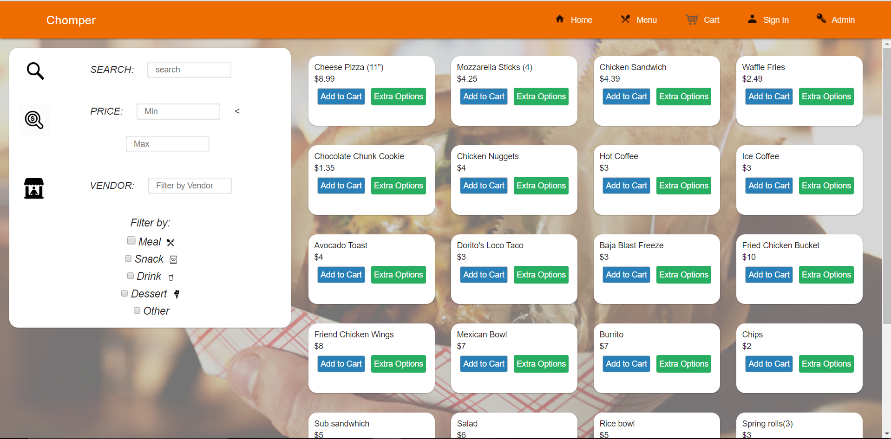
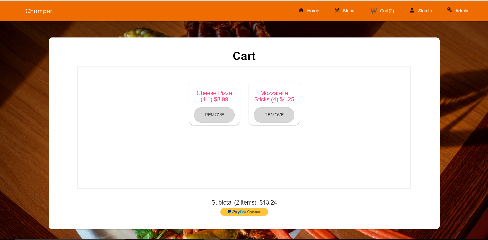
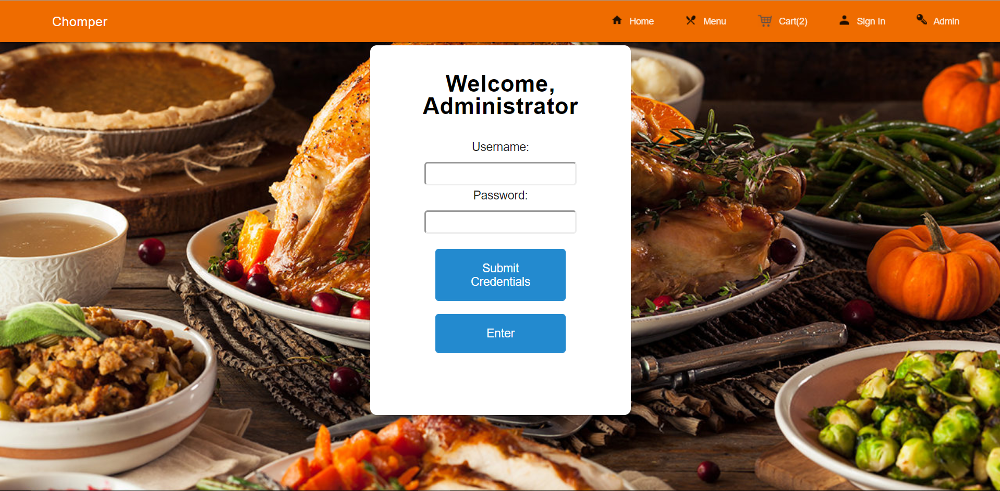

## Important Information
#### Deployed Heroku Link
[Chomper!](https://chomperapp.herokuapp.com/)

#### Pictures of Features
##### Landing Page

##### Sign-In Page

##### Menu Page

##### Cart Page

##### Admin Sign-In Page

#### Resources Used
- [Salting passwords](https://ciphertrick.com/salt-hash-passwords-using-nodejs-crypto/)
- Fetching API Data with React.JS – 
  https://blog.hellojs.org/fetching-api-data-with-react-js-460fe8bbf8f2
- React MDL: https://tleunen.github.io/react-mdl/
- React Personal Portfolio Project Playlist (used for reference on how to use React MDL) https://www.youtube.com/playlist?list=PL3KAvm6JMiowqFTXj3oPQkhP7aCgRHFTm
- CodePen MDL template -  https://codepen.io/SitePoint/pen/oxXdov
- CodePen Roster List - https://codepen.io/MitchYang/pen/BaayRzy
- CodePen Modal Box - https://codepen.io/Idered/pen/vytkH
- https://tamalweb.com/how-to-properly-handle-your-users-passwords
- https://daveceddia.com/deploy-react-express-app-heroku/
- React Paypal tutorial: https://www.robinwieruch.de/react-paypal-payment                          	   
- React Baby Names: https://github.com/simonswiss/react-baby-names
- https://www.youtube.com/watch?v=DGtNLoY64ZQ&list=PLHrxuCR-0CcT7hgVVlh0lBWTqYkEEF55m
- https://www.npmjs.com/package/react-number-format

## Set-Up & Use
First, run `npm install` from the root. After this you will run `npm run-script install-all` from the root. From now on run this command anytime you want to install all modules again.

Setup the connection to the MongoDB database of your choosing based on the environments below.
- local development: create a config file (make sure to name it config.js) in the config folder, which exports your db.uri connection. This file will be ignored by git so your db credentials will be kept safe when the app is deployed.
- production: Since the config file is not pushed when you deploy your app, you must specifiy your db uri in heorku. Set the uri in heroku as specified in [this](https://devcenter.heroku.com/articles/config-vars) resource. Make sure you name the environement variable "DB_URI".

In the project directory, you can run:

### `npm run-script dev`

Runs both the client app and the server app in development mode. 
Open [http://localhost:3000](http://localhost:3000) to view the client in the browser.

### `npm run-script client`

Runs just the client app in development mode. 
Open [http://localhost:3000](http://localhost:3000) to view the client in the browser.

### `npm run-script server`

Runs just the server in development mode. 

### `npm run build`

Builds the app for production to the `build` folder. 
It correctly bundles React in production mode and optimizes the build for the best performance.

